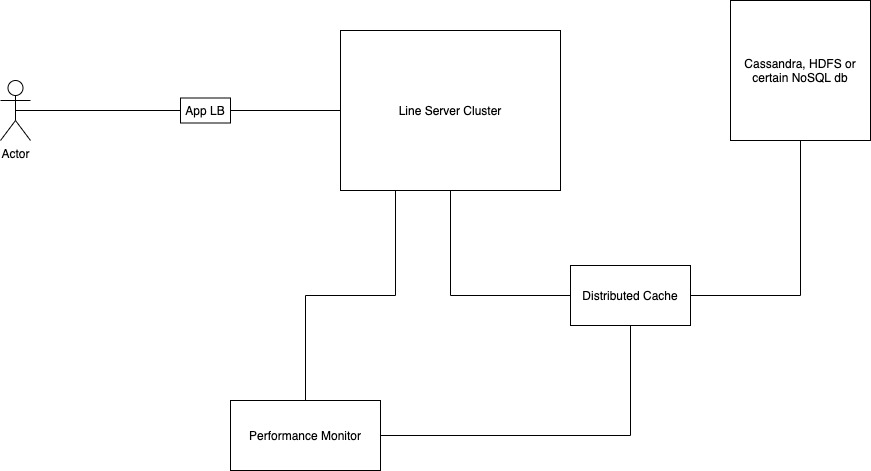
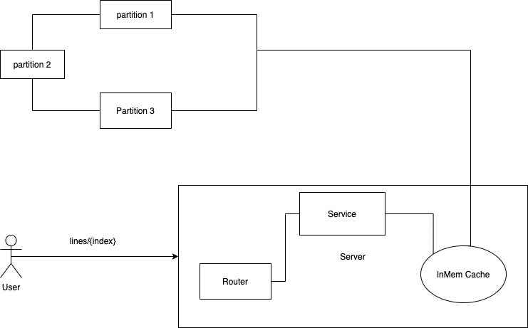

# Line Server

## Development
__NOTE__: The following steps are only tested on OSX. Due to the differences between `Sed` on Mac and `Sed` on Linux, 
the `run.sh` won't work on Linux.

### Prerequisites
- JDK 8
- Kotlin 1.3.61
```
brew update
brew install kotlin
```

### Build
```
./build.sh [partition root] [partition size] [absolute path to the input file] [diff_on flag]
```
- [partition root]: path to the directory where all partitions are stored
- [partition size]: __number of lines__ for each partition (Note: it's __not__ the __size__)
- [abolute path to the input file]
- [diff_on flag]: set to 1 to turn on the diff log where you can see the comparision between Expected output if retrieve from the original file,
and the Actual output retrieved from the cache/partitions. 

### Run
```bash
./run.sh [absolute path to the input file]
```

### Examples
- Test with the 5kb file, small partition and diff on
```bash
filename=5kb.txt
./build.sh /Users/mli/work/line-server/tmp 10 /Users/mli/work/line-server/$filename 1
./run.sh /Users/mli/work/line-server/$filename
```

- Test with the 6.5MB file, big partition and diff off
```bash
filename=6dot5mb.txt
./build.sh /Users/mli/work/line-server/tmp 3000 /Users/mli/work/line-server/$filename 0
./run.sh /Users/mli/work/line-server/$filename
```

Run `curl -X GET http://localhost:5005/lines/28`

## Design
The design changed from "what I wanted to do" to "what I actually can do" when considering limit on time and other resources.

 ===> 

### Server (Ktor + Netty)
[Ktor](https://ktor.io/servers/): Lightweight, async, Kotlin based framework. 

[Netty](https://ktor.io/servers/configuration.html#netty): embedded Netty engine provided by Ktor

### Cache
[Guava Cache](https://github.com/google/guava/wiki/CachesExplained#caches)


### DB (actually just some partitions)
Because of the "access by id" pattern of the API, my first reaction is to use Cassandra or some key-value store or Hadoop, looks overkill for a small assignment.
Therefore, I chose to simply partition the input file based on the [partition size] input. 
It's much easier to partition a file by line number 
rather than by size where I have to handle special cases where a line is truncated.

### A Glance of the Code
- Main.kt
1. Contains entry point of the app
2. Parse application related variable and inject into `CacheService()` and `LineService()` as dependencies
3. Setup the routes, default error handling, interceptors and some other Ktor features/plugins

- service.kt
1. `LineService` contains the handler of the "get line by id" request. The service first calculate which partition to lookup based on `{index}`.
Then it convert `{index}` into the `localIndex` within the partition. You can think the "which partition to lookup" as basic Hash function.
2. `CacheService` handles which partition to lookup and how when cache is missed. We can pre-load some cache at app start, but it's not implemented here,
instead, cache is loaded on demand.

## Thinking of Production
- How does your system work? (if not addressed in comments in source)

    See [Design](#design), [A Glance of the Code](#a-glance-of-the-code)

- How will your system perform with a 1 GB file? a 10 GB file? a 100 GB file?

    - 1GB is no problem on my little Mac
    - Let's talk about 10GB, 100GB and more.
      - I need to import the input files into some NoSQL, let `lineNumber` as the key
      - Config the db cluster (partitioning, sharding, # of nodes) properly based on read/write throughput
      - Use distributed cache cluster instead of in-memory cache
      - Pay attention to client side load balancing if the db client does not provide the feature

- How will your system perform with 100 users? 10000 users? 1000000 users?
    - Scale Horizontally
        - Add load balancer in front the app instances
        - If these users are from globally, consider multi-region deployment and let users from region A call load balancer in region A unless it's a fallback
    - Scale Vertically
        - Tune the Netty parameters - queue size, connection size, worker group size, call group size, etc
        - use better VM instances
    - Use CDN
        - If the input file content don't change very often, and I need to handle 100 million concurrent users, I would probably use CDN to reduce the 
        number of calls to my backend, rather than adding more resources to support 100 million. Usually CDN can reach cache hit ratio around 70-80%

- What documentation, websites, papers, etc did you consult in doing this assignment?
    - [Ktor](https://ktor.io/servers/): Lightweight, async, Kotlin based framework. 
    - [Guava Cache](https://github.com/google/guava/wiki/CachesExplained#caches)
    - Got the 6.5mb sample [here](file from https://norvig.com/big.txt)
    - Completed the assignment independently on Sunday afternoon and evening.
    
- What third-party libraries or other tools does the system use? How did you choose each library or framework you used?
    - [Kotlin](https://kotlinlang.org/)
    - [Ktor](https://ktor.io/servers/): Lightweight, async, Kotlin based framework. 
    - [Guava Cache](https://github.com/google/guava/wiki/CachesExplained#caches)
    - Criteria
        - no verbose language like Java
        - lightweight framework (no Spring)
        - something I am familiar with but not necessarily master
        
- How long did you spend on this exercise? If you had unlimited more time to spend on this, how would you spend it and how would you prioritize each item?
    - It took me some time from overthinking to coming up with a feasible solution which I can complete in Sunday evening.
    I spent around 5 hours to write the code and 1 hour to write the doc.
    - I don't think I can ever have "unlimited" time on any project. If, let I have "enough" time, I would do (the following items are ordered by priority)
        - dockerization (yes as you read above, the `run.sh` only works on OSX right now)
        - Build the infrastructure in cloud (especially the database)
        - Deploy to cloud
        - use docker-compose for local dev
        - a simplest CICD pipeline
        - Performance test (probably use Gatling)

- If you were to critique your code, what would you have to say about it?
    - No unit tests, functional tests. The way to test right now is throgh the `diff_on` flag
    - No thorough custom excpetion and error code handling. Right now it only handles 404
    - build and run scripts only work on OSX
    - Not a expert on BASH script
    - Cache policy is very simple - no preload, only load on demand, simple cache expiration, every thing is in memory
 